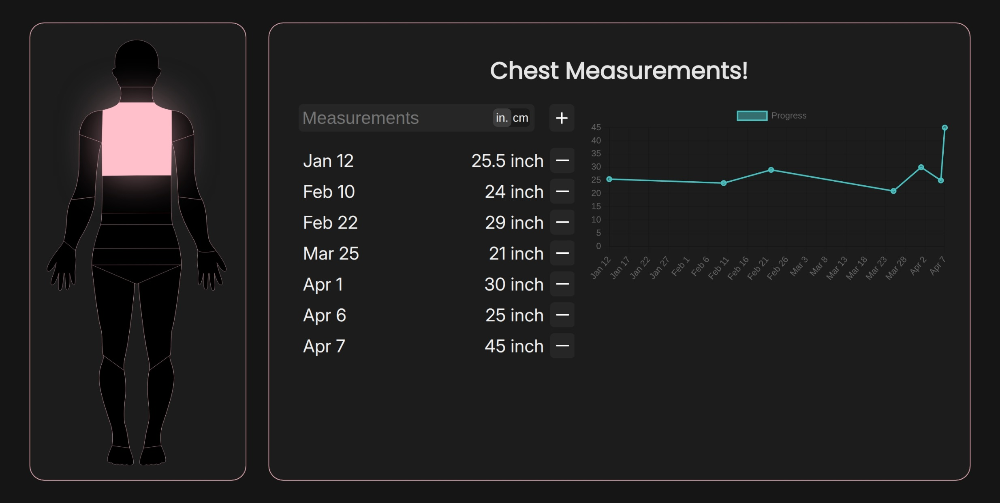

# 💪 Gaining

a visual body measurements tracker. click a body part, log your measurements, watch your progress over time.

**[live demo →](https://gaining.vercel.app)**

## features

- interactive body SVG so you can click on any body part to track it
- log measurements in **inches or cm**
- progress chart powered by Chart.js
- all data saved locally using localStorage (no signup!)
- clean dark UI

## tech stack

- vanilla JavaScript
- Chart.js
- localStorage
- HTML/CSS

## running locally

just clone and open, no build step needed.

\`\`\`bash
git clone https://github.com/devtribal/gaining.git
cd gaining
open index.html
\`\`\`

## usage

1. click a body part on the avatar
2. enter your measurement
3. switch between in/cm using the toggle
4. track progress on the chart over time

## license

MIT
